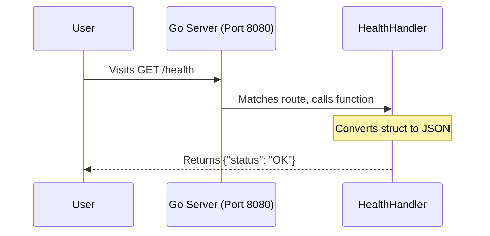

# Lesson 1: Creating a Go REST API from Scratch

In this lesson, we will build a Go REST API step-by-step, just like we did in the DB-Crusher project. We won't jump straight to the final code; instead, we will build it piece by piece so you understand exactly how it works.

## Step 1: The Foundation

Every Go application that runs as an executable must start with `package main`. We will also need to import a few packages from Go's standard library to handle web requests.

```go
package main

import (
    "fmt"       // Used for printing messages to the console
    "net/http"  // The core Go library for building HTTP web servers
    "encoding/json" // Used to convert our Go data into JSON for the user
)
```

## Step 2: Defining Our Data

APIs usually communicate using JSON. In Go, we use `structs` (which are like blueprints) to define what our data looks like. Let's create a blueprint for a simple "Health Check" response.

```go
// HealthResponse is the blueprint for our API response
type HealthResponse struct {
    Status string `json:"status"` // The `json:"status"` tag tells Go how to format this when converting to JSON
}
```

## Step 3: Writing an Endpoint Handler

A "Handler" is just a function that takes an incoming HTTP request from a user and sends back an HTTP response. Let's build our `HealthHandler` step-by-step.

First, we write the function signature. Every HTTP handler in Go must take these two exact arguments:
```go
func HealthHandler(w http.ResponseWriter, r *http.Request) {
    // w: is the "ResponseWriter". We use this to send data BACK to the user.
    // r: is the "Request". It contains info ABOUT the user's request (like the URL or headers).
}
```

Next, we tell the user's browser that we are sending JSON data, not plain text or HTML:
```go
func HealthHandler(w http.ResponseWriter, r *http.Request) {
    w.Header().Set("Content-Type", "application/json")
    
    // Create actual data using the struct we defined earlier
    statusData := HealthResponse{
        Status: "OK",
    }
}
```

Finally, we convert our `statusData` struct into a JSON string and send it through `w` (the ResponseWriter):
```go
func HealthHandler(w http.ResponseWriter, r *http.Request) {
    w.Header().Set("Content-Type", "application/json")
    
    statusData := HealthResponse{
        Status: "OK",
    }
    
    // Encode the struct to JSON and send it
    json.NewEncoder(w).Encode(statusData)
}
```

## Step 4: Routing and Starting the Server

Now that we have a handler, we need a router to direct traffic. We need to tell Go: *"When someone visits `/health`, run the `HealthHandler` function."*

We do this inside the `main()` function, which is the starting point of our program.

```go
func main() {
    // 1. Set up the route using Go's built-in router
    // We specify the HTTP method (GET) and the path (/health)
    http.HandleFunc("GET /health", HealthHandler)

    // 2. Print a helpful message to the console
    fmt.Println("Server is running on http://localhost:8080")

    // 3. Start the server on port 8080. 
    // ListenAndServe will block and run forever, waiting for users.
    err := http.ListenAndServe(":8080", nil)
    
    // 4. If the server crashes, print the error
    if err != nil {
        fmt.Println("Server crashed:", err)
    }
}
```

### Architecture Summary



In the next lesson, we will learn how to build a database connection from scratch and hook it into our handlers!
