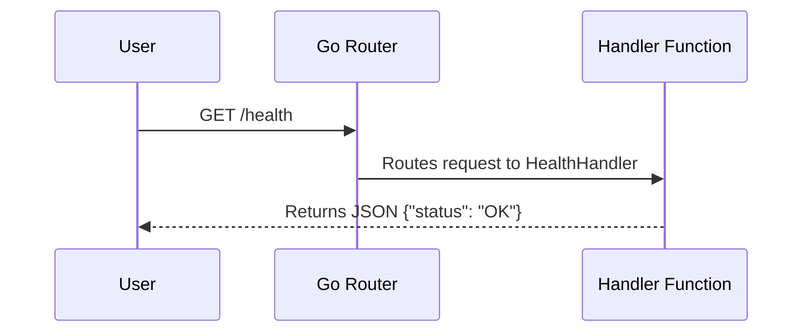

# Lesson 1: Creating a Go REST API

In this lesson, we will explore how the REST API was built from scratch in Go. 

## The Main Entry Point

Every Go application starts with a `main.go` file. We use the standard library `net/http` to spin up our server. Go 1.22 introduced an advanced routing feature natively, allowing us to specify HTTP methods (like `GET`, `POST`) directly in the route string.

Here's the core of how our server starts:

```go
func main() {
    // 1. We create our UserHandler which holds database and cache connections
    userHandler := &handlers.UserHandler{
        DB:    db,
        Cache: redisClient,
    }
    
    // 2. We register our API endpoints
    http.HandleFunc("GET /health", userHandler.HealthHandler)
    http.HandleFunc("GET /users", userHandler.GetUsersHandler)
    http.HandleFunc("GET /users/{id}", userHandler.GetUserHandler)
    http.HandleFunc("POST /users", userHandler.CreateUserHandler)
    http.HandleFunc("DELETE /users/{id}", userHandler.DeleteUserHandler)
    http.HandleFunc("GET /analytics", userHandler.GetAnalytics)

    // 3. We start the HTTP server on port 8080
    if err := http.ListenAndServe(":8080", nil); err != nil {
        fmt.Println("Server error! ", err)
    }
}
```

### Explaining the Code
*   **`http.HandleFunc`**: This function tells Go, "When a user visits this URL, run this specific function." For example, visiting `GET /health` runs `HealthHandler`.
*   **`http.ListenAndServe(":8080", nil)`**: This starts the server on port 8080 and listens for incoming requests indefinitely.

## Writing a Handler

A handler function is responsible for taking an incoming request and sending back a response. Let's look at the simple `HealthHandler`:

```go
func (h *UserHandler) HealthHandler(w http.ResponseWriter, r *http.Request) {
    // Step 1: Tell the client we are sending JSON data
    w.Header().Set("Content-Type", "application/json")

    // Step 2: Create our data structure
    status := HealthResponse{
        Status: "OK",
    }
    
    // Step 3: Convert the Go struct to JSON and send it as the response
    json.NewEncoder(w).Encode(status)
}
```

### The Architecture



In the next lesson, we will see how to connect this API to a real PostgreSQL database to serve real data!
