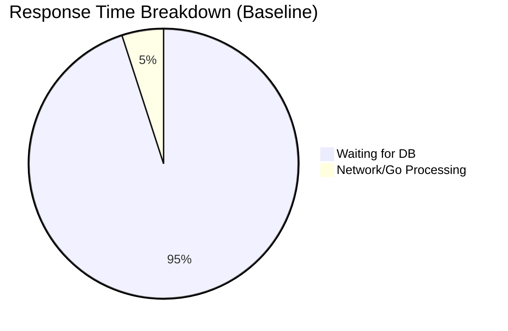

# Lesson 3: Load Testing with Apache JMeter

We built the API and connected it to Postgres. Now, it's time to see how much traffic it can handle before breaking. We use **Apache JMeter**, a tool that simulates thousands of users hitting our API simultaneously.

## What is a Test Plan?

A Test Plan in JMeter outlines exactly how the test should run. In our `analytics-baseline.jmx` file, we defined the following:
1.  **Thread Group**: This defines the users. We set it to simulate 2000 concurrent users.
2.  **HTTP Request**: We told the users exactly where to go: `GET http://localhost:8080/analytics`.
3.  **Listeners**: These are reporting tools that gather data like "Summary Report" and "Aggregate Report".

## The Baseline Results (Pre-Optimization)

We fired 2000 rapid requests at our `/analytics` endpoint. This endpoint forces the PostgreSQL database to do heavy grouping and math (`SUM`, `AVG`).

### What Happened?
*   **Average Response Time**: 1175 milliseconds (Over 1 second!)
*   **Maximum Response Time**: 4922 milliseconds (Almost 5 seconds!)
*   **Throughput**: 41 requests per second.



### Why Did This Happen?

Every single one of those 2000 requests was forcing PostgreSQL to recalculate the exact same analytics data from scratch. The database's CPU maxed out, causing a massive traffic jam.

```mermaid
sequenceDiagram
    participant 2000 Users
    participant API
    participant PostgreSQL
    
    2000 Users->>API: GET /analytics
    Note over API: All 2000 requests forwarded to DB
    API->>PostgreSQL: Execute Heavy SQL (2000 times)
    Note over PostgreSQL: CPU Overloaded, Queries Queued
    PostgreSQL-->>API: Returns Data (Very Slowly)
    API-->>2000 Users: Wait time 1-5 seconds
```

This is unacceptable for a production application. In the next lesson, we will fix this using Redis Caching.
