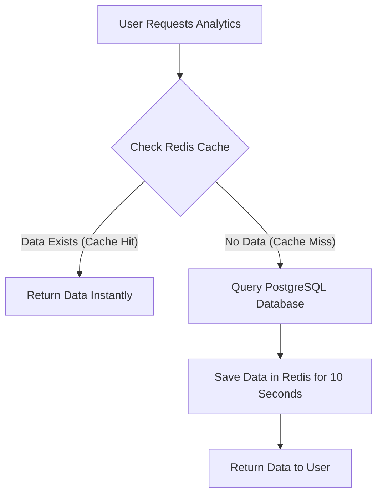

# Lesson 4: Supercharging Performance with Redis Caching

To solve the database bottleneck, we introduced **Redis**. Redis is an in-memory data store. Reading data from RAM (Redis) is thousands of times faster than reading from a hard drive and recalculating SQL (PostgreSQL).

## Setting Up Redis in Go

We used the `go-redis` library. Here is our simple wrapper `internal/cache/redis.go`:

```go
func NewRedisClient(ctx context.Context) (*RedisClient, error) {
    client := redis.NewClient(&redis.Options{
        Addr: "localhost:6379", // Default Redis port
    })

    // Ping it to ensure we connected successfully
    client.Ping(ctx)
    
    return &RedisClient{Client: client}, nil
}
```

## The Caching Logic (The Magic)

We updated our `GetAnalytics` handler. Instead of blindly querying the database, we follow the **Cache-Aside Pattern**:

```go
func (h *UserHandler) GetAnalytics(w http.ResponseWriter, r *http.Request) {
    // STEP 1: Ask Redis if it has the data
    cached, err := h.Cache.Get(ctx, "analytics")
    
    if err == nil {
        // CACHE HIT! We found it in Redis!
        // We decode the JSON and send it immediately.
        w.Write([]byte(cached))
        return // Stop here. Do not hit the database!
    }

    // STEP 2: CACHE MISS! Redis didn't have it. We must ask Postgres.
    analytics, _ := h.DB.GetAnalytics()

    // STEP 3: Convert the data to JSON
    data, _ := json.Marshal(analytics)

    // STEP 4: Save it in Redis for 10 seconds so the NEXT request gets a Cache Hit!
    h.Cache.Set(ctx, "analytics", string(data), 10*time.Second)

    // Finally, send the data to the user
    json.NewEncoder(w).Encode(analytics)
}
```

### Visualizing the Cache-Aside Pattern



## The Amazing Results

We re-ran the exact same JMeter test (2000 requests). 
*   **The first request** hit the database (Cache Miss) and took ~1 second.
*   **The remaining 1999 requests** hit Redis (Cache Hit) and were served instantly!

**Final Metrics:**
*   **Average Wait Time:** Dropped from 1175ms to **0ms**.
*   **Max Wait Time:** Dropped from 4922ms to **88ms** (that 88ms was just the very first request).
*   **Throughput:** Jumped from 41 req/sec to **101.3 req/sec**.

By implementing Redis, we protected our database from collapsing and provided a lightning-fast experience for the user.
